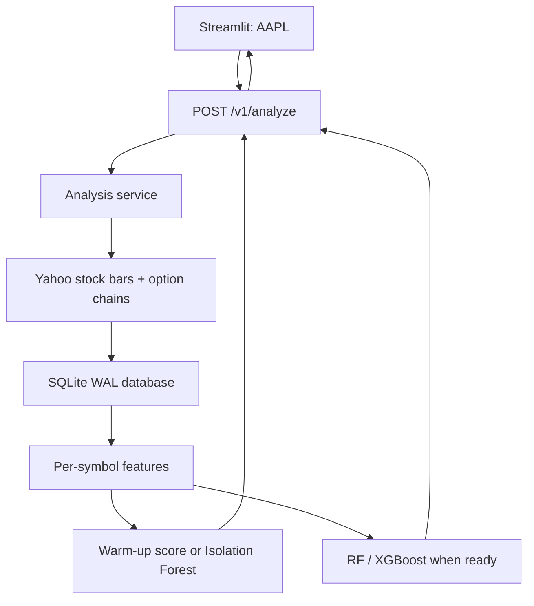

# Options Spike Intelligence — Production Edition

This project lets a client type a stock ticker in Streamlit, request a live/delayed Yahoo option-chain snapshot through FastAPI, save it in SQLite, engineer features, rank unusual option contracts, and—after enough history exists—run Isolation Forest and 15-minute direction models.

The production entry points contain no collector/model demo blocks. FastAPI, Streamlit, and the scheduler all call the same service layer, so there is one analysis workflow instead of three different implementations.

> This is an analytics and learning system, not investment advice or an order-execution platform. `yfinance` can be delayed, throttled, incomplete, or changed by Yahoo. Use a licensed brokerage/exchange data feed before making execution-dependent decisions.

## 1. What happens when a client types `AAPL`



Step by step:

1. Streamlit validates the ticker and sends it to FastAPI.
2. FastAPI validates the JSON request and optional `X-API-Key`.
3. The service takes a per-symbol lock so two requests for `AAPL` cannot run in the same process at the same time.
4. `yfinance` downloads up to five days of one-minute stock bars and the requested option expirations.
5. SQLite saves raw rows with primary keys, preventing duplicate snapshots and bars.
6. Feature engineering compares each contract with its own earlier observations and with the current option chain.
7. On the first snapshots, the system clearly labels results `cross_sectional_warmup`.
8. After at least 100 complete historical contract rows exist, Isolation Forest becomes the anomaly method.
9. After at least 120 labeled minute-level market rows exist, Random Forest and XGBoost can train per ticker.
10. The API returns the saved analysis, and Streamlit renders metrics, charts, spikes, contracts, and model status.
11. The ticker is registered in `tracked_symbols`; the scheduler keeps collecting it while the NYSE is open.

## 2. Start everything with Docker

From this project directory:

```bash
cp .env.example .env
docker compose up --build -d
docker compose ps
```

Open:

- Streamlit: <http://localhost:8501>
- FastAPI documentation: <http://localhost:8000/docs>
- Health endpoint: <http://localhost:8000/health>

Follow logs:

```bash
docker compose logs -f api dashboard scheduler
```

Stop the services without deleting data:

```bash
docker compose down
```

The `options_runtime` Docker volume retains SQLite data and model artifacts. `docker compose down -v` deletes that volume, so do not add `-v` unless permanent deletion is intended.

## 3. Use the dashboard

1. Go to `http://localhost:8501`.
2. Type a ticker such as `AAPL`, `NVDA`, `SPY`, or `BRK-B`.
3. Choose how many expiration dates to request.
4. Choose the percentage of strikes around the underlying price.
5. Leave **Train models when ready** enabled.
6. Press **Run live analysis**.
7. Review the four tabs:
   - **Market overview** shows stock price and estimated new call/put volume.
   - **Spike detector** shows the contracts with the highest activity/anomaly scores.
   - **Contract explorer** shows current bid, ask, volume, open interest, and IV.
   - **Model status** explains whether prediction is warming up or ready.

One snapshot can rank current-chain activity, but it cannot prove that volume “spiked over time.” Keep the scheduler running to build that history.

## 4. Use the API directly

Run one live analysis:

```bash
curl -X POST http://localhost:8000/v1/analyze \
  -H "Content-Type: application/json" \
  -H "X-API-Key: YOUR_KEY_IF_CONFIGURED" \
  -d '{"symbol":"AAPL","expiration_count":2,"strike_range_percent":0.10,"train_models":true}'
```

Read saved results without downloading Yahoo again:

```bash
curl http://localhost:8000/v1/analysis/AAPL
curl http://localhost:8000/v1/spikes/AAPL?limit=25
curl http://localhost:8000/v1/predict/AAPL
curl http://localhost:8000/v1/symbols
```

HTTP behavior:

- `200`: request succeeded, including honest `warming_up` model states.
- `401`: configured API key is missing or wrong.
- `422`: ticker or numeric input is invalid.
- `502`: Yahoo did not return usable market data after retries.
- `503`: SQLite is unavailable.

## 5. Run locally without Docker

Python 3.12 is recommended.

```bash
python -m venv .venv
```

Windows PowerShell:

```powershell
.venv\Scripts\Activate.ps1
pip install -r requirements.txt
$env:PYTHONPATH = "."
uvicorn api.main:app --host 0.0.0.0 --port 8000
```

In a second PowerShell window:

```powershell
.venv\Scripts\Activate.ps1
$env:PYTHONPATH = "."
$env:API_URL = "http://localhost:8000"
streamlit run dashboard/app.py
```

In a third PowerShell window:

```powershell
.venv\Scripts\Activate.ps1
$env:PYTHONPATH = "."
python -m data_collector.scheduler
```

## 6. Environment variables

| Variable | Default | Meaning |
|---|---:|---|
| `OPTIONS_DB_PATH` | `runtime/options_market.db` | SQLite file |
| `MODEL_DIR` | `runtime/models` | Per-ticker model artifacts |
| `DEFAULT_SYMBOLS` | `SPY,QQQ,NVDA` | Initial scheduler watchlist |
| `EXPIRATION_COUNT` | `2` | Expirations collected per ticker |
| `STRIKE_RANGE_PERCENT` | `0.10` | Strikes within ±10% of stock price |
| `COLLECTION_INTERVAL_SECONDS` | `60` | Open-market scheduler interval |
| `CLOSED_MARKET_SLEEP_SECONDS` | `300` | Closed-market polling interval |
| `AUTO_TRAIN` | `true` | Train stale models when enough data exists |
| `INSTALL_LSTM` | `false` | Install TensorFlow during the Docker build |
| `ENABLE_LSTM` | `false` | Enable optional, heavier TensorFlow model |
| `API_KEY` | blank | Optional client API key |
| `CORS_ORIGINS` | dashboard localhost URL | Allowed browser origins |
| `API_URL` | `http://localhost:8000` | API used by Streamlit |
| `LOG_LEVEL` | `INFO` | Runtime log level |

For production, set a strong `API_KEY`, restrict `CORS_ORIGINS`, place the services behind HTTPS, back up the Docker volume, and monitor provider errors.

To enable the LSTM in Docker, set both values below in `.env`, then rebuild:

```dotenv
INSTALL_LSTM=true
ENABLE_LSTM=true
```

```bash
docker compose build --no-cache
docker compose up -d
```

## 7. Every file explained

### Root files

#### `Dockerfile`

1. Starts with Python 3.12 slim.
2. Disables `.pyc` output and enables unbuffered logs.
3. Installs pinned dependencies.
4. Creates a non-root `appuser`.
5. Copies the project and starts one Uvicorn worker.

One worker is intentional for this SQLite/single-host design. For horizontal scaling, replace SQLite with PostgreSQL and move collection jobs to a distributed queue.

#### `docker-compose.yml`

1. Defines common environment variables.
2. Runs `api`, `dashboard`, and `scheduler` as separate containers.
3. Waits for API health before starting the other services.
4. Shares the `options_runtime` volume among them.
5. Restarts services unless an operator stops them.

#### `requirements.txt`

Pins the production versions of pandas, scikit-learn, yfinance, XGBoost, FastAPI, Streamlit, Plotly, the NYSE calendar, and HTTP dependencies. Pinning avoids an unreviewed package update changing behavior during deployment.

#### `requirements-lstm.txt`

Installs the normal requirements plus TensorFlow CPU. It is separate because TensorFlow greatly increases image size and startup time.

#### `.env.example`

Documents every runtime setting. Copy it to `.env`; do not commit a real API key.

#### `.gitignore` and `.dockerignore`

Keep secrets, databases, trained models, caches, and virtual environments out of source control and Docker build context.

### `config/`

#### `config/settings.py`

1. Reads environment variables once through `get_settings()`.
2. Converts comma-separated values, booleans, integers, and paths.
3. Applies safe bounds to expiration count, strike range, and scheduler intervals.
4. Gives every service exactly the same configuration.

#### `config/__init__.py`

Marks the directory as an importable Python package.

### `database/`

#### `database/db.py`

1. `get_connection()` opens SQLite with a 30-second busy timeout and foreign keys.
2. `initialize_database()` enables WAL and creates all tables/indexes.
3. `register_symbol()` records any client-entered ticker for future scheduled collection.
4. `save_option_snapshots()` and `save_stock_bars()` perform keyed upserts.
5. `replace_symbol_frame()` updates one ticker without deleting another ticker’s features.
6. `upsert_model_registry()` records model paths, features, metrics, and training counts.
7. `start_pipeline_run()` and `finish_pipeline_run()` provide an operational audit trail.

Important tables:

- `option_snapshots`: raw option-chain observations.
- `stock_bars`: keyed one-minute OHLCV bars.
- `option_features`: contract-level engineered values.
- `market_features`: call/put aggregates joined to the underlying.
- `anomaly_results`: latest/history spike scores.
- `model_registry`: per-ticker model metadata.
- `tracked_symbols`: live scheduler watchlist.
- `pipeline_runs`: success/failure history.

#### `database/__init__.py`

Marks the directory as a package.

### `data_collector/`

#### `data_collector/yahoo_provider.py`

1. `normalize_symbol()` validates client input.
2. `_retry()` retries transient Yahoo failures with increasing delays.
3. `fetch_stock_bars()` downloads five days of one-minute OHLCV and normalizes timestamps.
4. `fetch_option_chain()` loops through every requested expiration and both CALL/PUT sides.
5. It filters strikes around the current stock price and normalizes Yahoo column names.
6. `collect_symbol()` saves raw stock/options data and registers the ticker.

#### `data_collector/scheduler.py`

1. Uses the official NYSE calendar to recognize weekends, holidays, and early closes.
2. Registers default tickers at startup.
3. Reads all dynamically tracked tickers before each cycle.
4. Calls the same `analyze_symbol()` service used by FastAPI.
5. Handles `SIGINT`/`SIGTERM` so Docker can stop it cleanly.

The only `if __name__ == "__main__"` block launches this real production scheduler; it is not a test/demo block.

#### `data_collector/__init__.py`

Marks the directory as a package.

### `features/`

#### `features/feature_engineering.py`

1. `safe_divide()` changes zero denominators to missing values instead of creating infinity.
2. `build_option_features()` calculates midpoint, spread, moneyness, days to expiration, volume changes, option returns, IV changes, volume/OI, and historical volume z-scores.
3. It rejects deltas across gaps larger than 2.5 minutes.
4. It also creates a robust cross-sectional z-score, which works on the first snapshot.
5. `activity_score` combines positive historical deviation, current-chain deviation, and volume/OI.
6. `aggregate_option_market()` produces one CALL/PUT row per ticker-minute.
7. `build_stock_features()` creates 1-minute/5-minute returns, volume z-score, and an exact-gap-checked 15-minute target.
8. `create_model_dataset()` performs a backward timestamp merge and saves only the requested ticker.

Future price and `target_up_15m` are labels only; they are never model inputs.

#### `features/__init__.py`

Marks the directory as a package.

### `models/`

#### `models/isolation_forest.py`

1. Reads one ticker’s contract features.
2. Before 100 complete historical rows, ranks current-chain activity and labels the method `cross_sectional_warmup`.
3. After 100 rows, fits a per-ticker Isolation Forest.
4. Scores volume delta/z-score, option return, IV change, spread, volume/OI, and moneyness.
5. Saves both scores and the fitted artifact.

#### `models/common.py`

1. Defines one approved feature list for Random Forest and XGBoost.
2. Loads only one ticker and rejects stale stock/option timestamp joins.
3. Uses a chronological 80/20 split rather than a random split.
4. Calculates accuracy, precision, recall, F1, ROC-AUC, and majority baseline.
5. Saves artifacts under `runtime/models/<SYMBOL>/`.
6. `train_if_stale()` avoids retraining every minute without enough new data.
7. `predict_latest()` returns a clear warm-up state when inference is not valid.

#### `models/random_forest.py` and `models/xgboost_model.py`

Expose short production training functions that call the shared, validated trainer. They contain no direct-execution test/demo code.

#### `models/lstm_model.py`

1. Imports TensorFlow only when LSTM training is enabled.
2. Requires at least 600 labeled rows.
3. Scales using training data only.
4. Builds 30-minute sequences without crossing days or missing-data gaps.
5. Uses chronological training, validation, and test sections.
6. Saves the Keras network and matching scaler per ticker.

#### `models/__init__.py`

Marks the directory as a package.

### `services/`

#### `services/analysis_service.py`

This is the central workflow. `analyze_symbol()` runs collection → features → spike detection → optional model training → prediction, records success/failure, and returns one structured response. Read-only helpers return dashboard history, spikes, predictions, model metadata, and tracked symbols.

#### `services/__init__.py`

Marks the directory as a package.

### `api/`

#### `api/schemas.py`

Defines the public `AnalyzeRequest` and validates ticker, expiration count, strike range, and training flag before work begins.

#### `api/main.py`

1. Initializes SQLite during FastAPI startup.
2. Configures restricted CORS.
3. Optionally enforces `X-API-Key` on `/v1/*` endpoints.
4. Maps provider, validation, and database failures to useful HTTP status codes.
5. Exposes analyze, read-analysis, spikes, prediction, and symbols routes.

#### `api/__init__.py`

Marks the directory as a package.

### `dashboard/`

#### `dashboard/app.py`

1. Accepts a free-form ticker instead of a fixed select box.
2. Calls FastAPI rather than directly mutating SQLite.
3. Displays live run progress and actionable error messages.
4. Separates overview, spikes, contracts, and model status into tabs.
5. Labels warm-up scores so clients do not mistake a first snapshot for historical proof.
6. Displays a model disclaimer instead of presenting scores as trade instructions.

#### `dashboard/__init__.py`

Marks the directory as a package.

## 8. Model interpretation

- `volume_delta`: estimated contracts added since the prior snapshot because Yahoo usually reports cumulative daily volume.
- `volume_zscore`: how unusual that delta is versus the same contract’s previous 20 observations.
- `cross_section_volume_zscore`: how unusual current volume is versus other contracts on the same side of the current chain.
- `volume_oi_ratio`: current volume divided by open interest; large values can indicate heavy activity relative to the existing position base.
- `activity_score`: a ranking score, not a calibrated probability.
- `anomaly_score`: larger means more unusual to Isolation Forest.
- `bullish_score`: supervised model output for whether the underlying is higher 15 minutes later; it is not guaranteed or execution-ready.

## 9. Production boundary

This build is production-oriented for a single Docker host and analytics clients. Before serving many users or placing trades, add a licensed real-time feed, PostgreSQL, a distributed job queue, HTTPS/reverse proxy, centralized logging/metrics, secrets management, user accounts/authorization, rate limiting, database backups, and formal model/data-drift monitoring.
